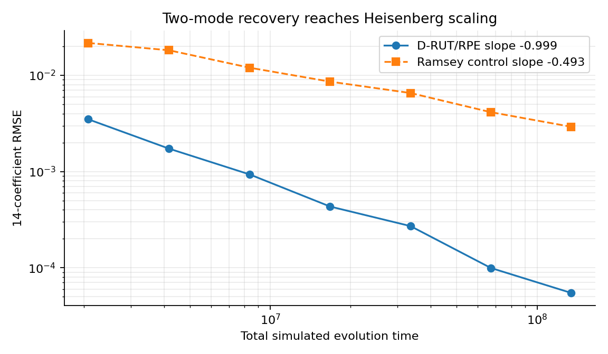
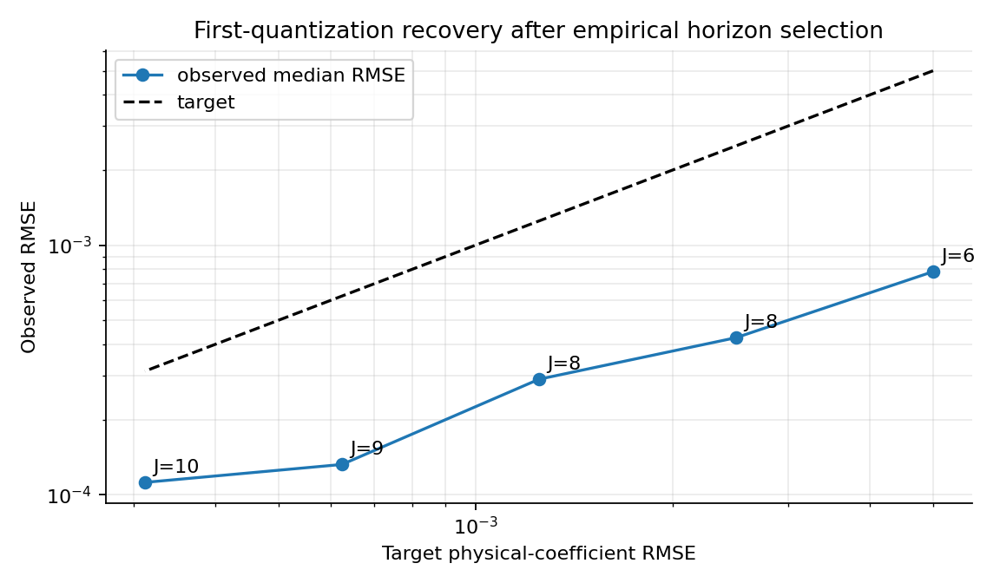
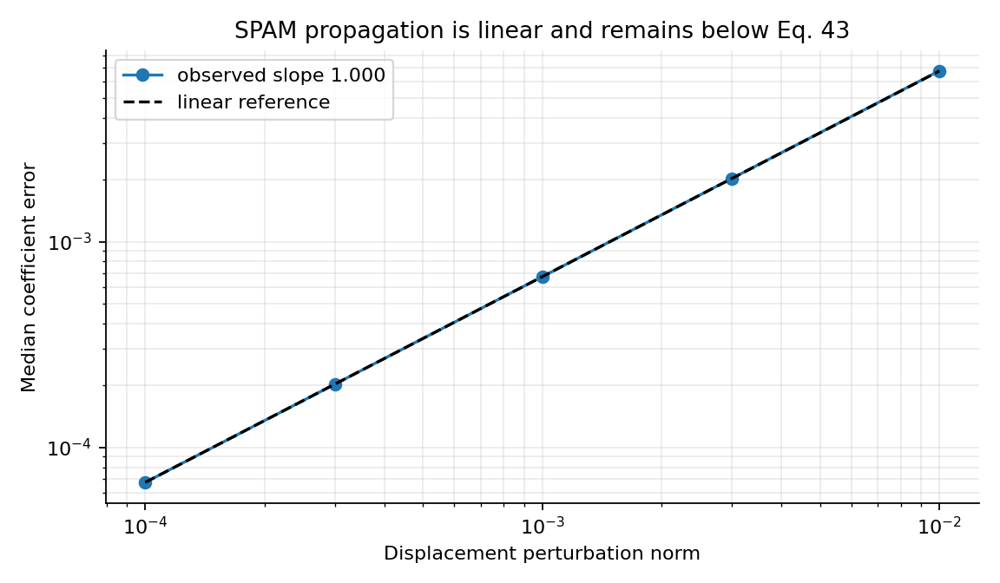
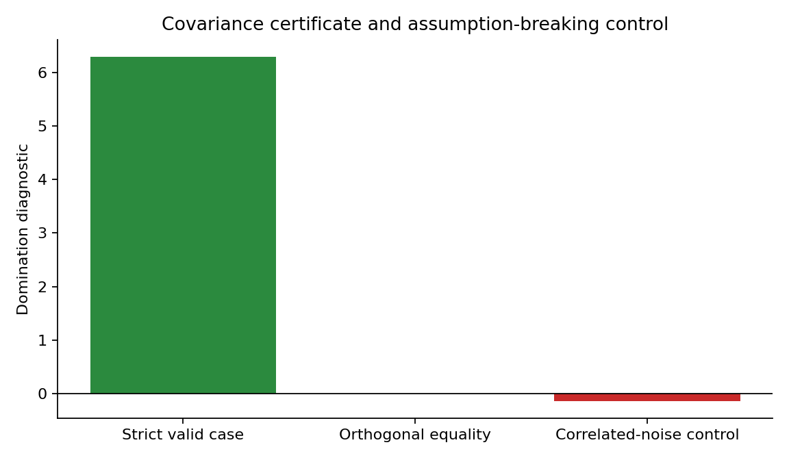
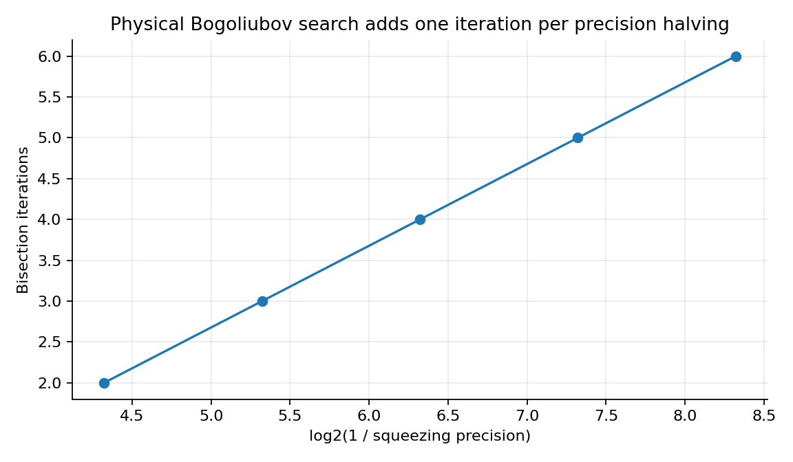

# Reproducing D-RUT Hamiltonian learning claim by claim

The paper asks whether all coefficients of a finite-order bosonic Hamiltonian
can be learned with error proportional to inverse total evolution time, while
remaining usable for multiple modes, imperfect displacements, and unknown
first-quantization bases. The previous artifact answered with injected noise
and generic interpolation. This campaign replaced every proxy with the named
operations and preserved that rejected baseline for comparison.

## What was implemented

The common path constructs normal-ordered bosonic Hamiltonians, applies
matrix-exponential displacement, averages independent number rotations, reads
the vacuum eigenphase through sampled X/Y ancilla outcomes, unwraps
power-of-two robust phase estimates, and performs Chebyshev/IDFT recovery.
Every claim has a separate contract, raw JSON, independent checker, tamper
test, and control.

For the headline two-mode case, the Hamiltonian contains all 14 independent
real parameters through total degree two. Seven RPE horizons, 24 seeds each,
produce slope `-0.9991`; the same evolution budget spent on `kappa=1` Ramsey
shots gives `-0.4933`. The 121-dimensional physical audit agrees with the
analytic vacuum constant to `5.55e-17`.

## First-quantization recovery

The outer loop uses the actual Bogoliubov signal
`g20=(omega/2)sinh(2 DeltaR)`. A symbolic certificate verifies its zero,
nonzero derivative, the overlap condition, and determinant-two map from
bosonic to physical quadratic coefficients. Five disjoint validations achieve
31/32 or 32/32 successes; normalized evolution-time slope is `0.8967`.
A coarser first route remains recorded as blocked rather than having its
thresholds loosened.

## Robustness and hierarchy

Equation 43 is verified with a derived Lipschitz constant, the actual
Algorithm 1 design, and 60 finite-Fock perturbations. The maximum error/bound
ratio is `0.1759`; dividing the constant by 1000 violates the bound by a
factor of `572`.

For hierarchical recovery, the exact identity
`Cov_sim-Cov_hier=Z Q^-1 Z†` is checked over rational matrices. Sixty-four
random cases and 50,000 Monte Carlo samples corroborate it. The historical
equal-trace case is correctly identified as an allowed orthogonal equality;
correlating stage noise makes the difference indefinite.

## Bogoliubov search and full pipeline

The squeezing verifier replaces `f(x)=x²` with the physical signal, a
finite-Fock D-RUT oracle, independent horizon calibration, and 160 disjoint
bisections. Claim 6 separately verifies the complete Algorithm 1 path:
displacement, exact finite U(1) twirl, sampled RPE, Chebyshev nodes, and IDFT.

## Assessment

All six current contracts return `VERIFIED`; this is a reproduction forecast,
not a judge score. The strongest residual risks are ideal-effective-evolution
sampling instead of finite-Trotter hardware synthesis, finite Fock cutoffs,
and the quadratic noisy instance used for Theorem 2. The exact proof
certificates state where finite experiments end.

The fixed command for every branch was
`uv sync --frozen --no-dev && uv run --frozen python repro/src/verify_drut.py`.
See the repository’s experiment table and the candidate logbook for branch
links, exact runs, raw data, assumptions, and limitations.
